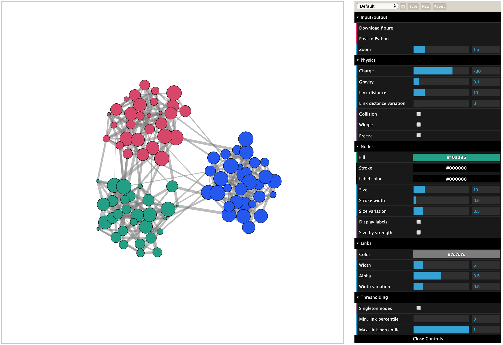

# Summary

Network visualization is an effective way to illustrate properties of a complex system. It is an important tool for exploring and spotting patterns, and is used by researchers and practitioners across many fields and industries.
Currently, there exists a number of tools for visualizing networks. *networkx* [@networkx] is a popular Python package for network analysis which provides limited functionality for computing layouts and plotting networks statically. Layout computations are done in Python or using the php-based software *Graphviz* [@graphviz], which is slow. *Gephi* [@gephi] and *Cytoscape* [@cytoscape] are dedicated visualization and analysis software programs. They are both Java-based and run desktop clients with a GUI, where users save and load networks as seperate files. *Webweb* [@webweb] enables interactive visualization for Python and Matlab networks using the d3.js [@d3] force layout. It's main purpose is exploration of network features and exporting one-time visualizations as SVG or HTML.

For many users, these tools offer the necessary functionality to visualize networks in most desired ways. However, since a growing population of network researchers and practitioners are relying on Python for doing network science [@developersurvey], it is increasingly pressing that a fast and intuitive Python tool for network visualization exists.

*Netwulf* is a light-weight Python library that provides an ultra simple API for interactively visualizing a network and returning the computed layout and style. It is build around the philosophy that network manipulation and preprocessing should be done programmatically, but that the efficient generation of a visually appealing network is best done interactively, without code. It allows users to:

1. create a network, `G`, in either dictionary or *networkx.Graph* format, then calling `netwulf.visualize(G)`, to
2. display it in a browser window as an interactive, manipulable, stylable network and 
   1. post the final style and computed node-positions back to Python in dictionary format, allowing further manipulation, or redrawing with matplotlib [@matplotlib], or
   2. save the image directly to the desktop as a PNG file.

The visualization component is implemented in JavaScript, relies on d3.js [@d3] for computing layouts, and uses canvas for rendering. This makes it, to our knowledge, the fastest tool for network visualization in Python. 

# Figures

# Acknowledgements

Both authors contributed equally to the software, documentation, and manuscript. B. F. M. is financially supported as an *Add-On Fellow for Interdisciplinary Life Science* by the Joachim Herz Stiftung.

# References

